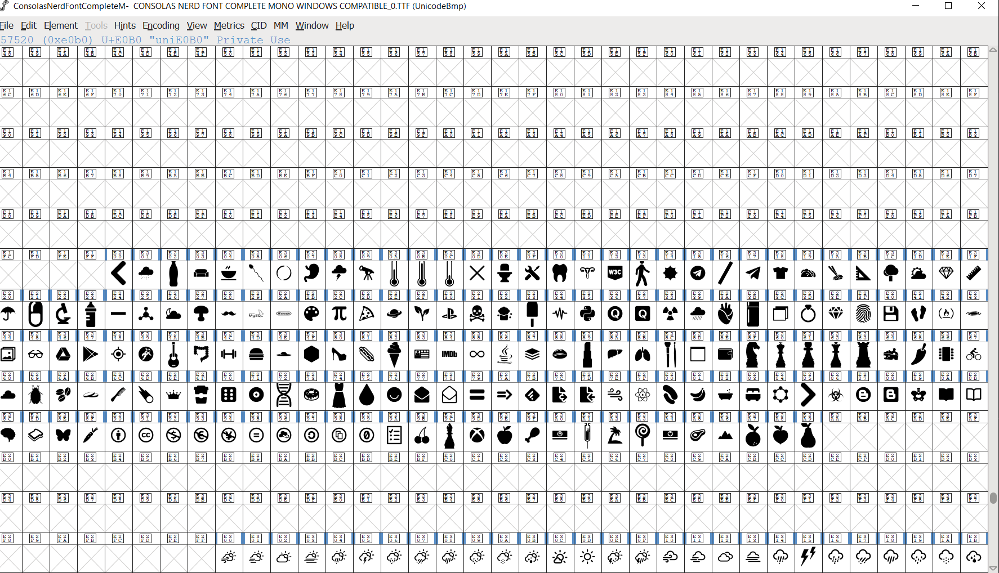

# Nerd fonts fix

I created this repository because I had this problem while using oh-my-posh with nerd fonts (https://github.com/ryanoasis/nerd-fonts/issues/1310).

## Usage:
* First install the provided fonts
* Then download the provided oh-my-posh themes and replace them  `C:\Users\<USER>\AppData\Local\Programs\oh-my-posh\themes`
* Choose the theme you would like to use (https://ohmyposh.dev/docs/installation/customize#config-syntax) `oh-my-posh init pwsh --config ~/jandedobbeleer.omp.json | Invoke-Expression`
<br>
<br>
It seems they updated to v3 and there are missing glyphs but if you download older fonts there are still missing icons.
<br>
If you create your own custom font from the font patcher they provide, it simply didn't work for me (https://github.com/ryanoasis/nerd-fonts).
<br>
<br>
So the solution was to use "fontForge" and map those missing unicode characters to other ones. The mapped characters work with the fonts provided that is the `Consolas Nerd Font`
<br>

<br>
<br>
I used the following powershell function to replace all characters, I loaded this into the `$profile` powershell file.
<br>
Usage: ReplaceStr themePath unicode1 unicode2
<br>
Example: `ReplaceStr C:\oh-my-posh\themes uea6c uf52 
```
function ReplaceStr {
    param (
        [string]$folderPath,
        [string]$searchString,
        [string]$replaceString
    )
    # Get all files in the folder
    $files = Get-ChildItem -Path $folderPath -File -Recurse

    # Loop through each file and replace the string
    foreach ($file in $files) {
        # Read the file content
        $content = Get-Content -Path $file.FullName -Raw

        # Replace the string
        $newContent = $content -replace $searchString, $replaceString

        # Write the updated content back to the file
        $newContent | Set-Content -Path $file.FullName
    }
}
```

<br>
I personally replaced this ones into the following ones

SEARCH STRING -> REPLACE STRING
<br>
* `\u2800` -> `\u0020` 
* `\ueba2` -> `\ue5fc`
* `\uea08` -> `\uf755` 
* `\ueb05` -> `\uf250` 
* `\uebcb` -> `\uf9e0`
* `\ueb99` -> `\uf508`
* `\ue641` -> `\uf017`

* `\ueb9e` -> `\uf989` 


